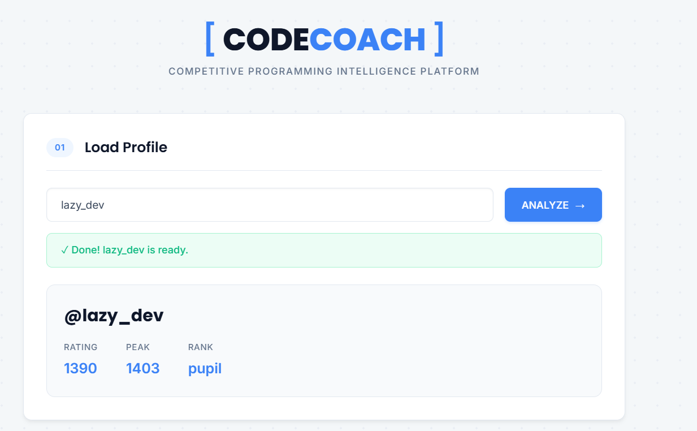
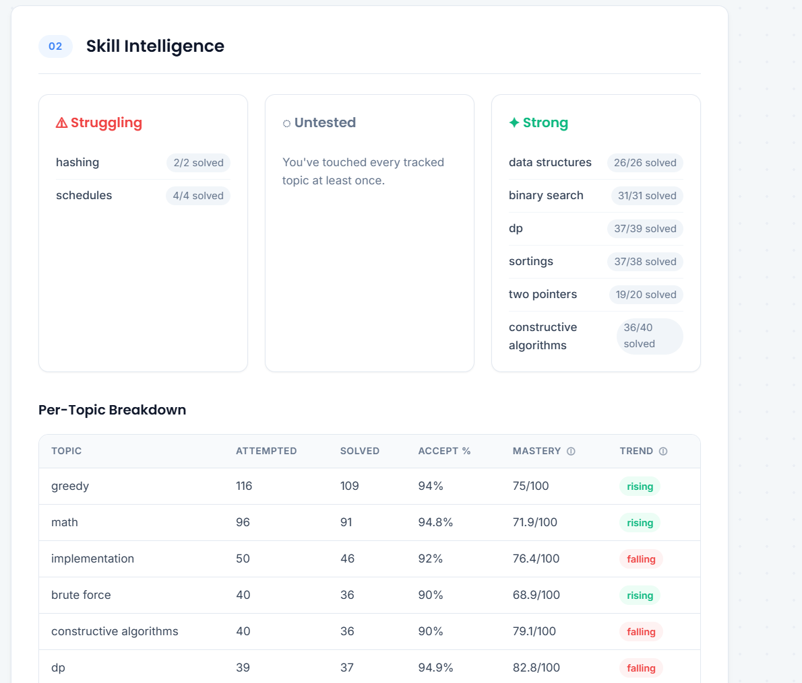
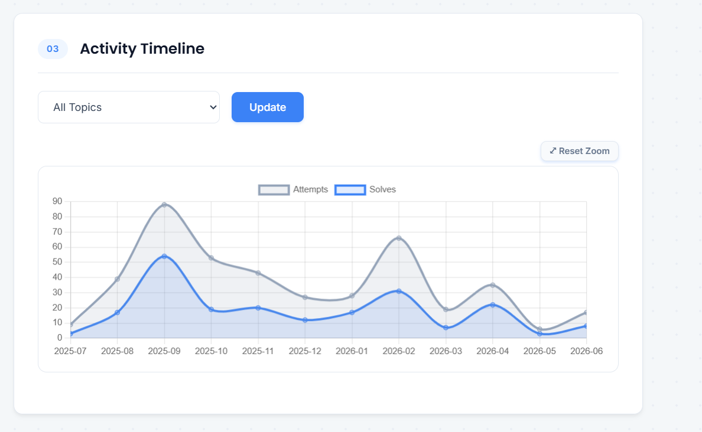
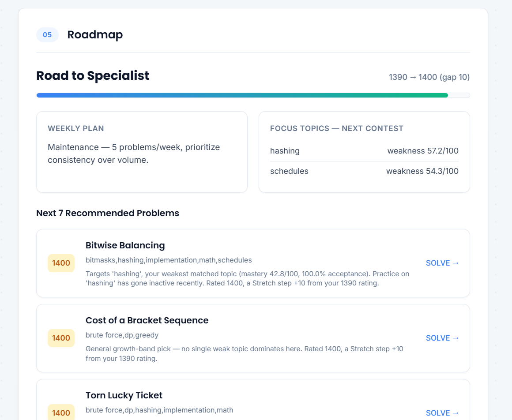
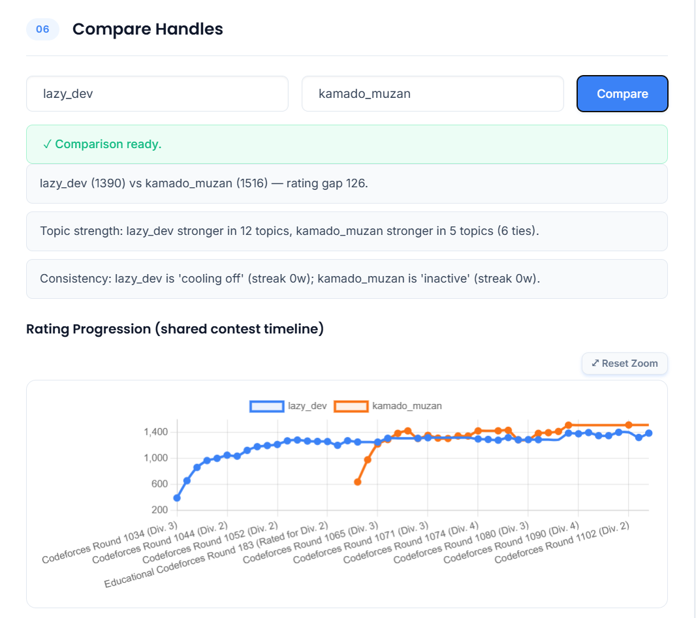
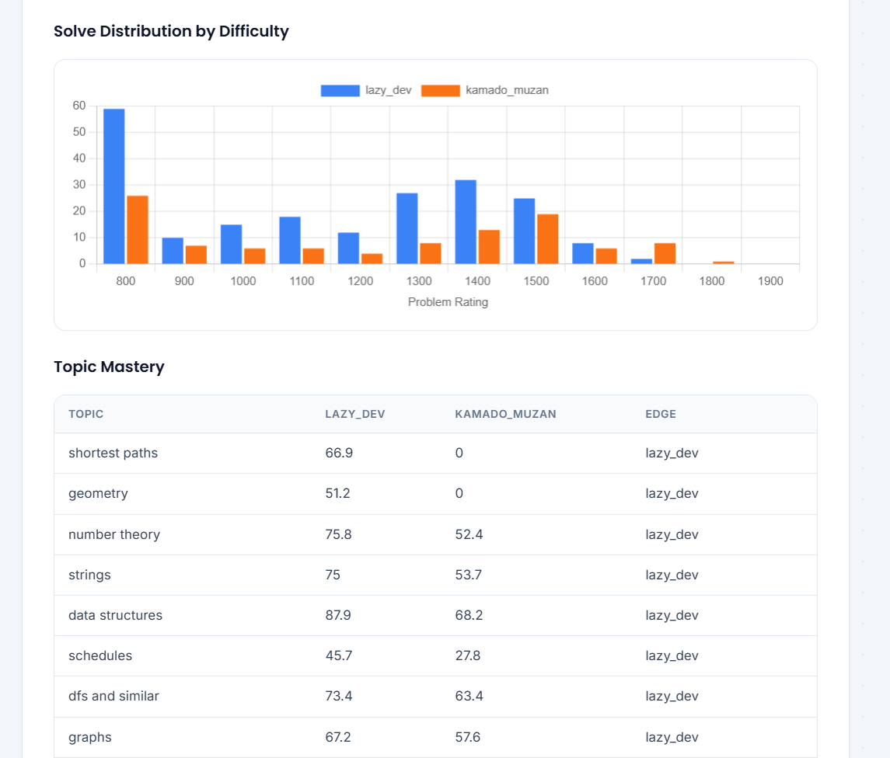

# CodeCoach

A web application for analyzing Codeforces profiles, identifying topic-wise strengths and weaknesses, and generating personalized practice recommendations.



---

## Overview

CodeCoach analyzes a Codeforces user's submission history and contest performance to generate meaningful insights instead of simply displaying statistics.

It helps answer questions such as:

- Which topics am I strongest in?
- Which topics need more practice?
- What problems should I solve next?
- How consistent has my practice been?
- How do I compare against another competitive programmer?

The project combines data collection, analytics, visualization, and recommendation generation into a single application.

---

## Features

- Topic-wise performance analysis
- Skill intelligence dashboard
- Acceptance percentage by topic
- Topic mastery score
- Monthly activity timeline
- Personalized practice roadmap
- Recommended Codeforces problems
- Codeforces handle comparison
- Rating progression comparison
- Difficulty distribution analysis

---

## Screenshots

### Skill Intelligence

Topic-wise strengths, weaknesses, mastery scores and acceptance rates.



---

### Activity Timeline

Visualizes monthly practice activity for any selected topic.



---

### Personalized Roadmap

Generates a personalized roadmap based on current rating, weak topics and recent activity.



---

### Handle Comparison

Compare two Codeforces users across multiple metrics.



---

### Comparison Analytics

Compare rating progression, solve distribution and topic mastery.



---

## How it Works

```text
Codeforces API
        │
        ▼
Profile & Submission Fetcher
        │
        ▼
SQLite Database
        │
        ▼
Analytics Engine
        │
        ▼
Recommendation Engine
        │
        ▼
Interactive Dashboard
```

The application fetches data using the official Codeforces API.

Endpoints used:

- `user.info`
- `user.status`
- `user.rating`
- `problemset.problems`

Every submission is stored locally to compute:

- Topic mastery
- Acceptance percentage
- Difficulty distribution
- Activity trends
- Personalized recommendations

---

## Tech Stack

**Backend**

- Python
- FastAPI
- SQLAlchemy
- SQLite

**Frontend**

- HTML
- CSS
- JavaScript
- Chart.js

**Data Source**

- Codeforces Public API

---

## Project Structure

```text
CodeCoach/
│
├── assets/
├── backend/
├── database/
├── frontend/
├── run.py
├── requirements.txt
├── cleanup_tags.py
└── README.md
```

---

## Installation

```bash
git clone https://github.com/YOUR_USERNAME/CodeCoach.git

cd CodeCoach

pip install -r requirements.txt

python run.py
```

Open

```
http://localhost:8000
```

---

## Key Analytics

The analytics engine computes:

- Topic-wise acceptance percentage
- Topic mastery score
- Solved vs attempted problems
- Practice consistency
- Activity trends
- Weak topic detection
- Difficulty distribution
- Rating progression
- Personalized practice roadmap

---

## Recommendation Engine

Recommendations are generated using multiple signals:

- Weak topics
- Current rating
- Target rating
- Recent activity
- Problem difficulty
- Previously solved problems

Each recommendation includes an explanation describing why it was selected.

---

## Comparison Engine

The comparison module supports:

- Rating progression
- Difficulty distribution
- Topic mastery comparison
- Relative strengths
- Relative weaknesses
- Topic advantage analysis

---

## Notes

- Built for educational and portfolio purposes.
- Designed for single-user local execution.
- Database is automatically created on first run.
- If the database schema changes during development, delete the local SQLite database and run the application again.

---

## License

This project is intended for educational and portfolio purposes.
